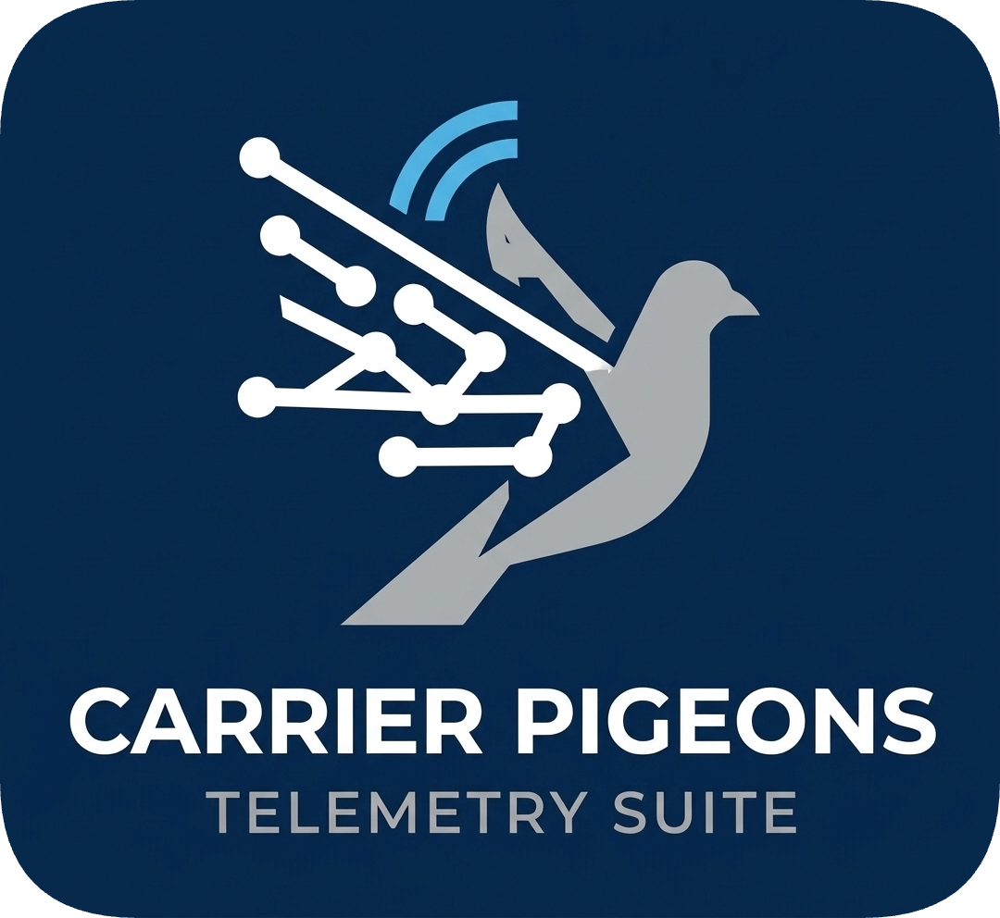

<div id="top">

<!-- HEADER STYLE: CLASSIC -->
<div align="center">



**Continuous Telemetric Documentation**  
*Reliably delivered at scale*

<!-- BADGES -->


</div>

<br>

---

## Overview

**CarrierPigeons** is a lightweight, production-ready Continuous Telemetric Documentation pipeline that collects system metrics from edge devices and reliably delivers them to centralized storage via MQTT—complete with robust state management, batch processing, and graceful lifecycle handling.

**Why CarrierPigeons?**

This project empowers developers to build scalable, observable infrastructure monitoring systems without reinventing core pub/sub, storage, and resilience patterns. Transitioning beyond passive logging, CarrierPigeons acts as a proactive edge observability layer, heavily optimized for AI inference hardware, multi-node clusters, and Open Research environments. All managed through centralized CLI & TUI PigeonCommand tool. 

<br>

---

## Features

|      | Component       | Details                                                                                                                                                                                                                                                                 |
| :--- | :-------------- | :---------------------------------------------------------------------------------------------------------------------------------------------------------------------------------------------------------------------------------------------------------------------- |
| 🚀   | **Pigeoneer Edge Agent**| **Hardware-Agnostic Collectors:** Auto-detects and independently polls Nvidia, AMD, Apple, and Intel GPUs. **AI Accelerator Support:** Dedicated Hailo, Google Coral, & Apple ANE NPU support featuring PCIe device isolation and array scaling. **State Awareness:** Event-driven heartbeat architecture utilizing MQTT Last Will and Testament (LWT) registries.
| 🏰   | **PigeonCoop Ingestion**| **Robust Storage:** PostgreSQL (pgxpool) powered CTD Ledger persistence with automated, zero-touch DDL schema migrations at startup. **Event Watchdog:** Native Ntfy integration for instant webhook alerts on offline or degraded hardware nodes.
| 🧠   | **Observability & AI** | **PigeonMCP Sidecar:** Standalone Model Context Protocol (MCP) server enabling tools like Ollama, Claude, ChatGPT, and more query the CDT Ledger natively. **PigeonCommand:** Interactive CLI/TUI for live diagnostics and dynamic cluster configuration. **Topological Context:** Native <code>NodeGroup</code> tagging to group correlated hardware failures for AI-assisted **PigeonCare+** incident triage.
| ⚙️   | **Architecture**  | **Modular Go Monorepo:** Structured using standard <code>cmd/</code>, <code>internal/</code>, and <code>pkg/</code> layouts. **Zero-Friction Deployment:** Compiles to static binaries with no CGO dependencies, enabling trivial cross-compilation for RISC-V, ARM, and x86 architectures. |

<br>

---

## Project Structure

```sh
└── /
    ├── cmd/
    │   ├── pigeoncoop/   # The ingestion/ledger engine
    │   ├── pigeoneer/    # The edge telemetry agent
    │   ├── pigeonmcp/    # The Model Context Protocol sidecar
    │   └── pigeons/      # The PigeonCommand CLI/TUI orchestrator
    ├── internal/
    │   ├── pigeoncoop/
    │   │   ├── broker/     # MQTT subscriber, event watchdog, and LWT registry logic
    │   │   ├── ledger/     # PostgreSQL connection pool and query wrappers
    │   │   └── migrations/ # Automated schema deployment
    │   ├── pigeoneer/
    │   │   ├── collectors/ # Hardware sensors (Nvidia, AMD, Intel, Hailo, RPi5)
    │   │   └── relay/      # MQTT publisher and LWT instantiation
    │   └── pigeons/
    │       └── cli/        # Cobra command definitions and Bubble Tea TUI
    └── pkg/
        └── core/           # Shared models (CTDPayload) and publisher interfaces
```

<br>

----

Made with ♥️ by
```py
DREW-V := {
  "Simplicity in the Architecture",
  "Efficiency in the Engineering",
  "Purity in the Science",
  "Audacity in the Art",
  "Life in the Logic"
}
```
